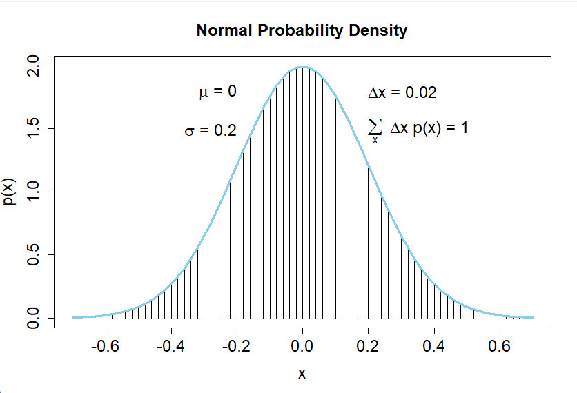
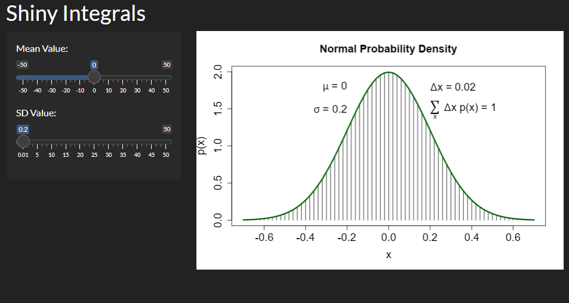

```{r, include = FALSE}
knitr::opts_chunk$set(
  collapse = TRUE,
  comment = "#>",
  message = FALSE,
  warning = FALSE,
  fig.align = 'center',
  fig.height = 4,
  fig.width = 6
)
```

```{r setup}
library(RosaDSA5403lab1)
```

# Introduction

This package contains three functions. The `integralBayes()` functions plots a normal model and lists appropriate labels for the calculated and given statistics. The `runningprop()` function simulates coin tosses and returns a plot of the simulation. The simulation probability of heads is labeled on the plot. The final function `bayesint()` opens a `Shiny App` in a browser window. It allows the user to change the mean and standard deviation of the plot with sliders.

# The `integralBayes()` Function

```{r}
integralBayes(meanval = 0, sdval = 0.2)
```

{Fig. 1}

When utilizing this app in the `R` work space, a new window with the plot will open up. A screenshot of the output is given in $Fig. 1$.

# The `runningprop()` Function

```{r}
runningprop(N = 500, pHeads = 0.5)
```

# The `ShinyIntegrals` Shiny App

This package contains a function, `bayesint()`, which will open the `Shiny App` in a new browser window. A screenshot of the app is presented below in $Fig. 2$.

{Fig. 2}

The `Shiny App` can be accessed in an active `R` session by running the following code:

```{r, eval=FALSE}
shiny::runGitHub(repo = "RosaDSA5403lab1", username = "brandanrosa", subdir = "inst/ShinyIntegrals")
```
